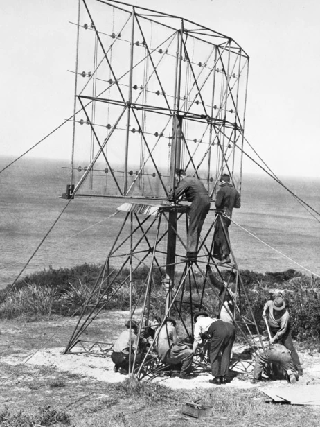

class: center, title-slide, middle
background-image: url("image/base.jpeg")
background-size: cover

<style>
.title-slide .remark-slide-number {
  display: none;
}
</style>
```{r load_packages, message=FALSE, warning=FALSE, include=FALSE}
library(fontawesome)
```
# Remote sensing: Synthetic Aperture Radar (SAR)

## Ling Yi Cheung

### 2023-02-03

---
#Sensors in Remote Sensing
Sensors are instruments that collect data about earth processes or atmospheric components.

- **Active sensors**: Provide own source of energy to illuminate object and its sensor measures reflected energy
- **Passive sensors**: Detect source of energy that is naturally available from the Sun

Synthetic Aperture Radar(SAR)is an example of Active sensor
```{r echo=FALSE, out.width='65%', fig.align='center'}
knitr::include_graphics('https://nisar.jpl.nasa.gov/rails/active_storage/blobs/eyJfcmFpbHMiOnsibWVzc2FnZSI6IkJBaHBLdz09IiwiZXhwIjpudWxsLCJwdXIiOiJibG9iX2lkIn19--0736d27477e77bc972495be072ecfaae4e0b06a6/SAR1.jpg?disposition=attachment')
```

.small[Source:(https://nisar.jpl.nasa.gov/mission/get-to-know-sar/overview/)
]
---
#What is Synthetic Aperture Radar (SAR)?
- World War II, the Radar was regarded as an invaluable defensive tool for identifying ships and planes in darkness and through cloud cover and fog.

- Limited by technology at that time, a high-flying plane would have had to carry an antenna almost as big as a football field to provide sufficient resolution

.pull-left[
- in 1951, An engineer named .my-style[**Carl Wiley**] solved the problem by developing:

.orange[**Simultaneous Buildup Doppler**] = The first SAR that...

.orange[*create detailed radar image using an antenna that is 1/100th the size of the football field-long antenna traditional radar would require to precisely analyze the frequency of the return signal*]
]

```{r echo=FALSE, out.width='30%', fig.align='right', fig.cap="Radar Station during WWII"}

```
.small[Source:(https://www.abc.net.au/news/2016-04-23/world-war-2-radar-station-jurien-bay-remnants-tell-story/7352324)
]
---
#Principles of SAR imagery 1
- SAR is an active **microwave** sensor on board, either space-borne or air-borne, that illuminates the target with a focused, directional beam of energy, producing unique scattering effect (.red[backscattering]) depending on the orientation of the sensed objects

Backscatter: the portion of outgoing radar signal that the target redirects towards the radar
Below shows a graph with different types of backscattering
<center>

<center>

.small[Source:(https://www.researchgate.net/figure/Radar-backscattering-mechanisms-for-forest-wetland-and-soil-surfaces-a-b-g-h_fig4_342872604)
]
---
#Principles of SAR imagery 2
.pull-left[

 - Pulsed radar system : PRF = Pulse Repetition Frequency
- Slant Range : Distance measured along a line between the antenna and the target 
 
- Nadir : Scanning in direction of Beam center + aperture synthesis .orange[(holography)]

- Coherent imaging: .orange[Phase] information and .orange[amplitude (brightness)] included in the complex-valued pixels
 ]
 
```{r echo=FALSE, out.width='50%', fig.align='right', fig.cap="SAR imaging geometry"}
knitr::include_graphics('https://au.mathworks.com/help/examples/radar/win64/SpaceborneSyntheticApertureRadarPerformancePredictionExample_01.png')
```
.small[Source:(https://www.mathworks.com/help/radar/ug/spaceborne-synthetic-aperture-radar-performance-prediction.html)
]

---
class: inverse
background-image: url("image/base2.jpeg")
background-size: cover
#Explaining SAR by Holly George-Samuels

Radar image: Day and night and all weather capability

SAR image: Large synthetic aperture created by combining multiple viewpoints of a small moving antenna to a single radar image

.center[<iframe width="560" height="315" src="https://www.youtube.com/embed/sGCJZtJVTWQ" title="YouTube video player" frameborder="0" allow="accelerometer; autoplay; clipboard-write; encrypted-media; gyroscope; picture-in-picture; web-share" allowfullscreen></iframe>]
---
#Development onf SAR
- The technology of SAR was put to non-military aspects since the 1970s...

```{r, results='asis', echo=FALSE}
xfun::file_string('SAR_application.html')
```

---
class: inverse
background-image: url(https://workshop.caltech.edu/SpaceborneSAR/img/Galapagos_Islands_in_the_Pacific_Ocean_mob.jpg)
#Some Pros and Cons of SAR imagery

 
.big[.pull-left[     😄

Simpler design process

Flexible, not limited by the time of day or atmospheric conditions

High resolution imagery

Accurately characterize topography and surface features in 3D through :
.orange[bistatic imaging with two satellites flying in formation or radargrammetry]]]


.big[.pull-right[    🙁

Geometric distortion 
.medium[ 

 * Change in position
* Rotation of earth
* Refraction and turbulence]

System nonlinear effects 
.medium[

  * Amplitude error, phase error degrades the system impulse response function (IRF)]
  


Speckle Noise effects 
.medium[

  * Granular pattern noise: created from interaction with high-frequency radar waves and targeted area]

]]
---
class: inverse, bg_karl
background-image: url(image/base.jpeg)
background-size: cover

#Summary of SAR imagery

.big[
- Coherent Radar System

- Operates in Microwave portion of electromagnetic spectrum

- Independent of solar illumination and adverse weather conditions

- Sensitive to small changes on the order of the radar wavelength 

- Utilise the time delay of the backscattered signals

- High resolution imagery

- Constrained by various limitations: geometric distortion, system nonlinear effects, Speckle Noise effects]
---
#Reference

ABC News (2016) ‘World War II radar station reveals tales of conflict in WA’, 23 April. Available at: https://www.abc.net.au/news/2016-04-23/world-war-2-radar-station-jurien-bay-remnants-tell-story/7352324 (Accessed: 8 March 2023).

Aplin, P. (2004) ‘Remote sensing: land cover’, Progress in Physical Geography: Earth and Environment, 28(2), pp. 283–293. Available at: https://doi.org/10.1191/0309133304pp413pr.

Earth Science Data Systems, N. (2020) What is Synthetic Aperture Radar?, Earthdata. Earth Science Data Systems, NASA. Available at: https://www.earthdata.nasa.gov/learn/backgrounders/what-is-sar (Accessed: 8 March 2023).

Laurencelle, J. (2019) What is SAR?, ASF. Available at: https://asf.alaska.edu/information/sar-information/what-is-sar/ (Accessed: 8 March 2023).

Ottinger, M. and Kuenzer, C. (2020) ‘Spaceborne L‐Band Synthetic Aperture Radar Data for Geoscientific Analyses in Coastal Land Applications: A Review’, Remote Sensing, 12, p. 2228. Available at: https://doi.org/10.3390/rs12142228.
---
#Reference
Spaceborne Synthetic Aperture Radar Performance Prediction - MATLAB & Simulink (no date). Available at: https://www.mathworks.com/help/radar/ug/spaceborne-synthetic-aperture-radar-performance-prediction.html (Accessed: 8 March 2023).

Synthetic Aperture Radar: “Round the Clock Reconnaissance” (2022) Lockheed Martin. Available at: https://www.lockheedmartin.com/en-us/news/features/history/sar.html (Accessed: 8 March 2023).

Tempfli, K. et al. (2009) ‘Principles of remote sensing : an introductory textbook.’, in, pp. 56–85.

User Guides - Sentinel-1 SAR - Definitions - Sentinel Online - Sentinel Online (no date). Available at: https://sentinels.copernicus.eu/web/sentinel/user-guides/sentinel-1-sar/definitions (Accessed: 8 March 2023).


